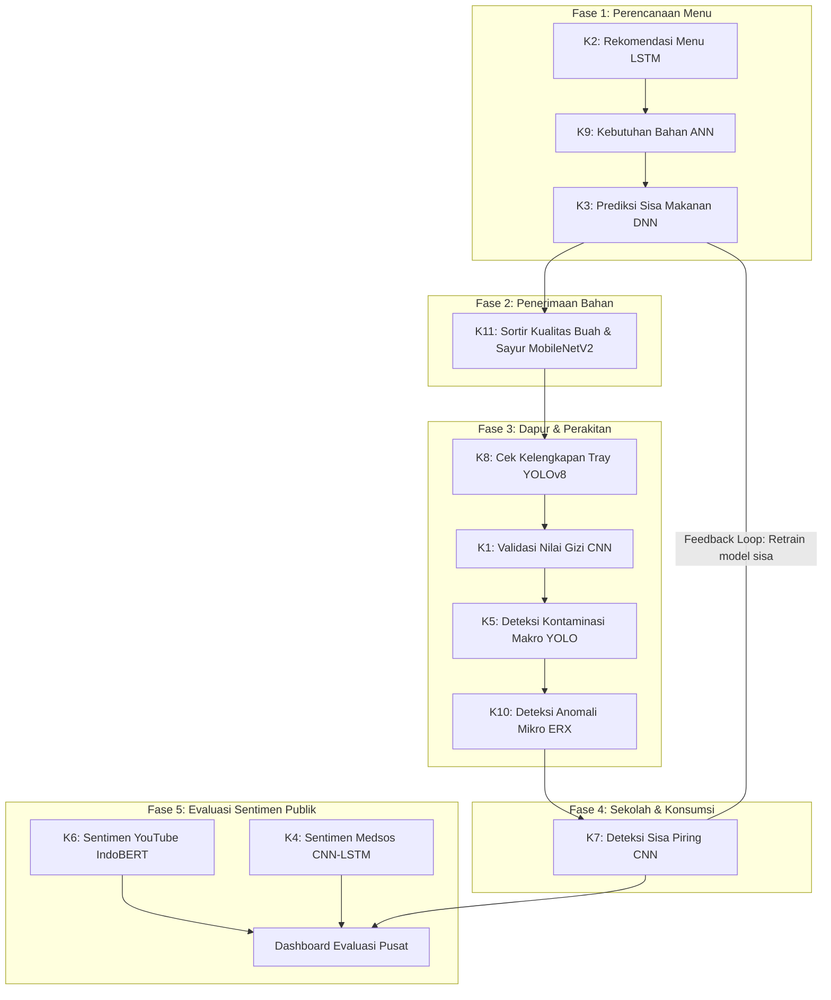

# NutriChain AI: Sistem Cerdas Terintegrasi Manajemen MBG
## Audit, Pemantauan, dan Verifikasi Cerdas Makan Bergizi Gratis (MBG) Nasional
### Berbasis Deep Learning End-to-End - TA 2025/2026

NutriChain AI adalah platform digital terintegrasi yang dirancang untuk mengotomatisasi pengawasan, jaminan mutu, dan keamanan pangan dalam rantai distribusi program Makan Bergizi Gratis (MBG) nasional. Sistem ini mensinkronisasikan 11 modul Deep Learning ke dalam 5 fase Standard Operating Procedure (SOP) operasional secara asinkron dari hulu ke hilir.

---

## Hasil Evaluasi dan Analisis Kinerja Model (UAS Report)

| Kelompok | Fokus Modul AI | Arsitektur & Metode | Key Performance Metrics (Akurasi / Loss) |
| :--- | :--- | :--- | :--- |
| **Kelompok 1** | Hitung Kandungan Gizi Visual | CNN (Visual & Weight Input) | **Akurasi 80.88%** - Test Loss 0.9158 (20 kelas makanan) |
| **Kelompok 2** | Rekomendasi Menu Pendamping | LSTM Sequence Generator | **Akurasi Testing 97.67%** (Belajar >18.000 kombinasi resep) |
| **Kelompok 3** | Prediksi Preferensi Siswa | DNN Classifier Tabular | **Balanced Accuracy 99.52%** - F1-Score 92.31% |
| **Kelompok 4** | Sentimen Media Sosial | CNN-LSTM & Word Embedding | **Akurasi Validasi 96.6%** - F1-Score 0.95 |
| **Kelompok 5** | Deteksi Benda Asing Makro | YOLO Object Detection | **mAP50 94.95%** - Inferensi 5.1ms/frame (kawat, plastik, rambut, ulat) |
| **Kelompok 6** | Sentimen Komentar YouTube | IndoBERT & LSTM Forecasting | **Akurasi Sentimen 87.51%** - Bebas Overfitting |
| **Kelompok 7** | Deteksi Sisa Makanan Piring | CNN Transfer Learning | **Akurasi Pengujian 98.96%** (Klasifikasi Habis / Sisa) |
| **Kelompok 8** | Kelengkapan Baki Makanan | YOLOv8 Instance Segmentation | **mAP50 93.7%** (mAP50 Makanan Pokok 95.8%) |
| **Kelompok 9** | Prediksi Logistik Kebutuhan | ANN (MLPRegressor) | **$R^2$ Score:** SD (0.838), SMP (0.891), SMA (0.774), SLB (0.934) |
| **Kelompok 10**| Deteksi Anomali Spektrogram | ERX Hiperspektral / Conv1D | **Akurasi, Presisi, Recall, & AUC 100%** (NIR-HSI 96 band) |
| **Kelompok 11**| Sortir Kualitas Kesegaran | CNN MobileNetV2 | **Validation Accuracy 98.67%** - Loss 0.0372 |

---

## Alur Kegiatan Operasional (SOP Pipeline)

Sistem operasi NutriChain AI terstruktur secara linear untuk mengawal aliran data dari dapur umum hingga laporan akhir:



---

## Panduan Pengembangan dan Git Workflows (PENTING)

Untuk menjaga stabilitas ekosistem NutriChain AI selama integrasi kolaboratif:

### 1. Batasan Modifikasi Kode
- **Modul UI Kelompok**: Lakukan edit *hanya* pada folder template kelompok Anda (`web/templates/Kelompok_X/kelompok_X.html`).
- **Backend Flask (`web/app.py`)**: Lakukan modifikasi routing/api *hanya* pada blok penanda komentar kelompok Anda. Jangan mengutak-atik routing utama (`/`, `/status`, `/dashboard`) atau kelompok lain.
- **Dynamic CSS/Themes**: Tulis CSS kustom Anda di dalam tag `<style>` pada berkas HTML kelompok Anda sendiri. Dilarang mengubah stylesheet global `web/static/style.css` secara langsung.

### 2. Standar Commit & Pull
Sebelum memulai pekerjaan, tarik selalu update terbaru:
```bash
git pull origin main
```
Gunakan target file yang spesifik ketika melakukan stage file, lalu commit menggunakan format standar:
```bash
git add web/templates/Kelompok_X/
git add web/app.py
git commit -m "feat: kelompok X menyelesaikan integrasi model ke UI utama"
git push origin main
```

---

## Persyaratan Sistem dan Spesifikasi Dependensi (Requirements)

Untuk menjalankan platform NutriChain AI secara lokal dengan performa optimal untuk seluruh 11 model Deep Learning, pastikan perangkat Anda memenuhi spesifikasi minimum berikut:

### 1. Persyaratan Perangkat Keras (Hardware Requirements)
- **Prosesor (CPU):** Intel Core i5/AMD Ryzen 5 (Rekomendasi: Intel Core i7 atau setara).
- **Memori RAM:** Minimum 8 GB (Rekomendasi: 16 GB untuk meminimalkan latensi load model TensorFlow secara simultan).
- **Penyimpanan:** Kapasitas kosong minimum 5 GB (untuk bobot model .keras, .h5, dan bobot YOLO .pt).
- **GPU (Opsional):** NVIDIA GPU dengan CUDA support (sangat direkomendasikan untuk akselerasi deteksi objek YOLOv8 real-time pada web-cam stream).

### 2. Persyaratan Perangkat Lunak (Software Requirements)
- **Sistem Operasi:** Windows 10/11, macOS, atau Linux (Ubuntu 20.04+).
- **Python Version:** Python 3.8, 3.9, atau 3.10 (Sangat direkomendasikan Python 3.10 untuk menjamin kecocokan pustaka tensorflow dan h5py pada sistem operasi Windows).
- **C++ Build Tools:** Microsoft Visual C++ 14.0 atau yang lebih baru (khusus bagi pengguna Windows guna mendukung kompilasi modul native).

### 3. Daftar Dependensi Pustaka Python (Python Requirements)
Pasang seluruh paket Python di bawah ini menggunakan pip. Anda dapat membuat file requirements.txt atau menginstalnya langsung:

```bash
pip install Flask==3.0.2
pip install numpy==1.26.4
pip install pandas==2.2.1
pip install tensorflow==2.15.0
pip install opencv-python==4.9.0.80
pip install pillow==10.2.0
pip install ultralytics==8.1.29
pip install scikit-learn==1.4.1.post1
pip install joblib==1.3.2
pip install h5py==3.10.0
pip install flask-cors==4.0.0
```

---

## Cara Menjalankan Aplikasi Secara Lokal

### 1. Kloning Repositori
```bash
git clone <url-repositori-anda>
cd Project_System_MBG
```

### 2. Pemasangan Dependensi
Pastikan python sudah terinstal pada komputer Anda, lalu jalankan pemasangan paket dependensi sistem:
```bash
pip install -r requirements.txt
```
*(Atau gunakan perintah pip install langsung sesuai daftar di bagian Persyaratan Sistem).*

### 3. Menjalankan Server Web Flask
Jalankan aplikasi dari direktori kerja utama proyek (direktori yang berisi folder web):
```bash
python web/app.py
```

Setelah server aktif, buka browser Anda dan akses alamat lokal: **http://127.0.0.1:5050**
