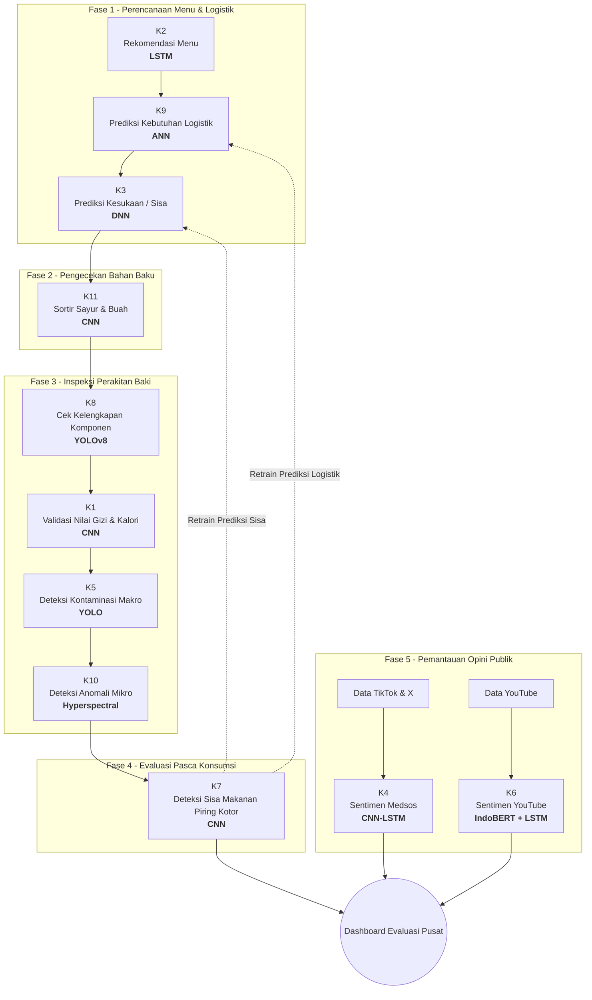

# NutriChain AI: Sistem Cerdas Terintegrasi Manajemen MBG
## Audit, Pemantauan, dan Verifikasi Cerdas Makan Bergizi Gratis (MBG) Nasional
### Berbasis Deep Learning End-to-End - TA 2025/2026

NutriChain AI adalah platform digital terintegrasi yang dirancang untuk mengotomatisasi pengawasan, jaminan mutu, dan keamanan pangan dalam rantai distribusi program Makan Bergizi Gratis (MBG) nasional. Sistem ini mensinkronisasikan 11 modul Deep Learning ke dalam 5 fase Standard Operating Procedure (SOP) operasional secara asinkron dari hulu ke hilir.

---

## Hasil Evaluasi dan Analisis Kinerja Model (UAS Report)

| Kelompok | Fokus Modul AI | Arsitektur & Metode | Key Performance Metrics (Akurasi / Loss) |
| :--- | :--- | :--- | :--- |
| **Kelompok 1** | Analisis Kandungan Gizi | CNN | **Akurasi 80.88%** - Test Loss 0.9158 (20 klasifikasi makanan Indonesia) |
| **Kelompok 2** | Rekomendasi Menu | LSTM | **Akurasi Data Testing 97.67%** (Belajar >18.000 kombinasi resep) |
| **Kelompok 3** | Prediksi Kesukaan | DNN | **Balanced Accuracy 99.52%** - F1-Score 92.31% (Sisa makanan) |
| **Kelompok 4** | Sentimen TikTok & X | CNN-LSTM | **Akurasi 96.6%** pada data validasi (F1-Score 0.95) |
| **Kelompok 5** | Deteksi Kontaminasi Makro | YOLO | **mAP50 94.95%** - Confidence Score hingga 85% (5.1ms/gambar) |
| **Kelompok 6** | Sentimen YouTube | IndoBERT & LSTM | **Akurasi 87.51%** - Proyeksi 30 hari bebas overfitting |
| **Kelompok 7** | Deteksi Sisa Piring | CNN | **Akurasi Pengujian 98.96%** (Klasifikasi Suka / Bersisa) |
| **Kelompok 8** | Kelengkapan Tray | YOLOv8 | **mAP50 93.7%** (mAP50 Makanan Pokok 95.8%) |
| **Kelompok 9** | Prediksi Kebutuhan Logistik | ANN | **$R^2$ Score (Test):** SLB (0.934), SMP (0.891), SMK (0.878), SD (0.838), SMA (0.774) |
| **Kelompok 10**| Deteksi Anomali Hiperspektral | CNN | **Akurasi, Presisi, Recall, & AUC 100% (1.0000)** (NIR-HSI 96 band) |
| **Kelompok 11**| Klasifikasi Kualitas Bahan | MobileNetV2 | **Akurasi Validasi 98.67%** - Loss 0.0372 (Piecewise Linear) |

---

## Alur Kegiatan Operasional (SOP Pipeline)

Sistem operasi NutriChain AI terstruktur secara linear untuk mengawal aliran data dari dapur umum hingga laporan akhir:



---

## Panduan Pengembangan dan Git Workflows (PENTING)

Untuk menjaga stabilitas ekosistem NutriChain AI selama integrasi kolaboratif:

### 1. Batasan Modifikasi Kode
- **Modul UI Kelompok**: Lakukan edit *hanya* pada folder template kelompok Anda (`web/templates/Kelompok_X/kelompok_X.html`).
- **Backend Flask (`web/app.py`)**: Lakukan modifikasi routing/api *hanya* pada blok penanda komentar kelompok Anda. Jangan mengutak-atik routing utama (`/`, `/status`, `/dashboard`) atau kelompok lain.
- **Dynamic CSS/Themes**: Tulis CSS kustom Anda di dalam tag `<style>` pada berkas HTML kelompok Anda sendiri. Dilarang mengubah stylesheet global `web/static/style.css` secara langsung.

### 2. Standar Commit & Pull
Sebelum memulai pekerjaan, tarik selalu update terbaru:
```bash
git pull origin main
```
Gunakan target file yang spesifik ketika melakukan stage file, lalu commit menggunakan format standar:
```bash
git add web/templates/Kelompok_X/
git add web/app.py
git commit -m "feat: kelompok X menyelesaikan integrasi model ke UI utama"
git push origin main
```

---

## Cara Menjalankan Aplikasi Secara Lokal

### 1. Prasyarat Sistem
- Python 3.8 - 3.10
- GPU Driver (Opsional, untuk inferensi YOLOv8 lebih cepat)

### 2. Pemasangan Dependensi
Pasang paket-paket inti yang dibutuhkan server web Flask:
```bash
pip install Flask pandas numpy opencv-python pillow ultralytics tensorflow scikit-learn joblib h5py flask-cors
```

### 3. Menjalankan Server
Eksekusi script Flask utama dari direktori root proyek:
```bash
python web/app.py
```
Aplikasi akan aktif secara lokal di: **http://127.0.0.1:5050**
